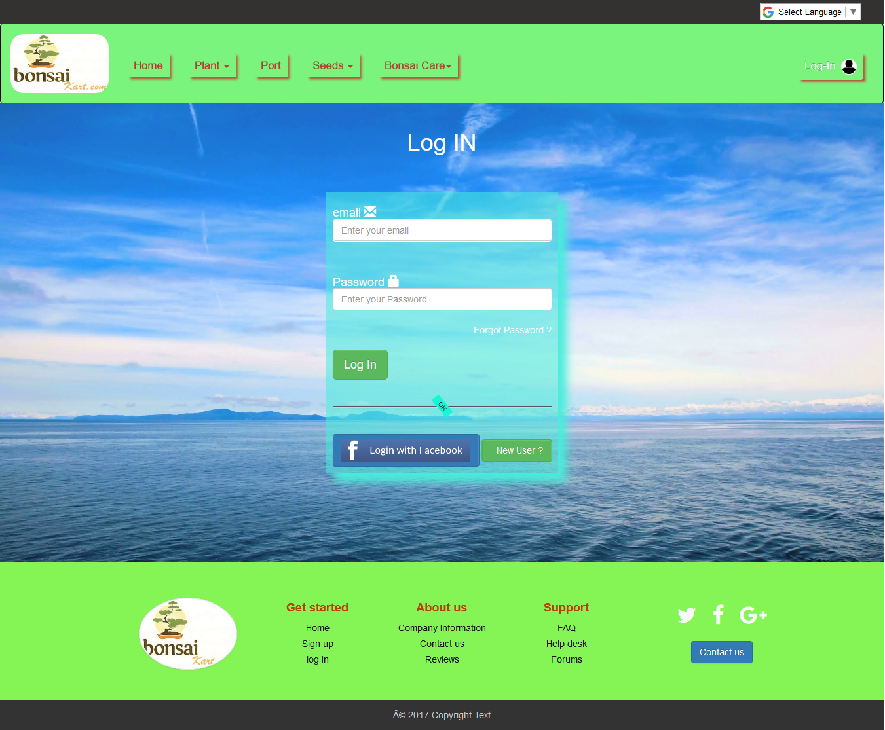
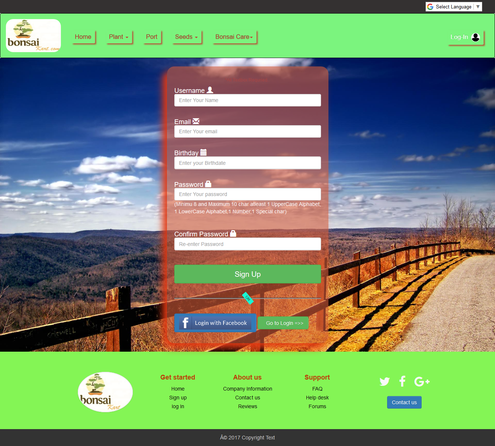
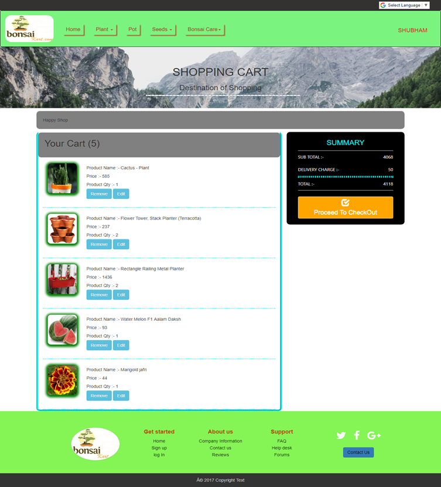
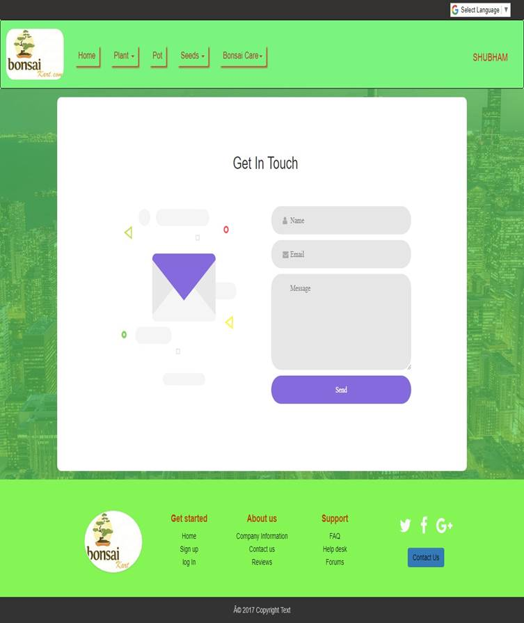
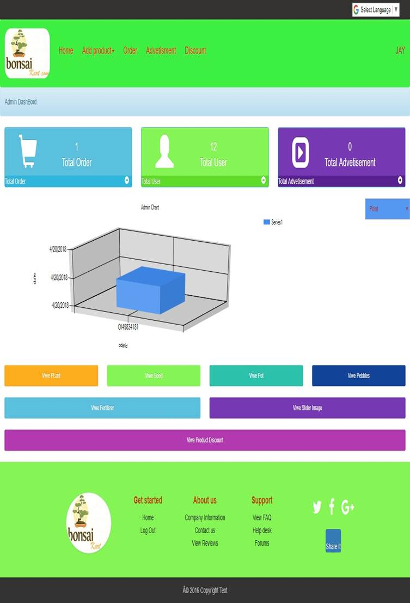

<h2>Project Overview</h2>

</a>
 

 
 

 

 

 

 

 

 

<h2>Environment:</h2>
Core Language : C# with ASP.NET Control
Scripting Language: JavaScript, jQuery
Frontend : Microsoft Visual Studio 2013, Bootstrap
Backend : MS SQL Server 2014

